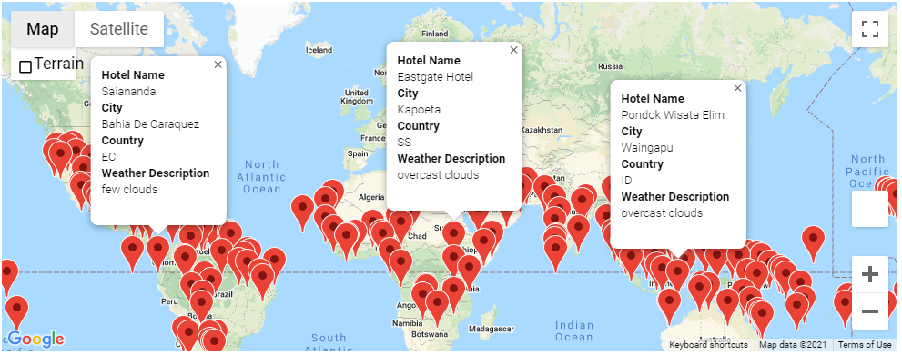

# World_Weather_Analysis

## Project Overview
This project includes generating current weather data for a number of random cities to help prospective vacationers book hotels in locations based on their preferred weather. This includes a random city generator, a map of the world with map markers (including hotel names, the city and country the hotel is in, the temperature and current weather description for the city), and an itinerary of driving instructions for a trip between four cities on our map.

## Results
We can see in the following map that our hotels have been marked on a map of the world. Each marker contains information including the hotel name, city and country, and the current weather description (at the time the code is run).

The following image also shows driving instructions that could be taken between four cities in Australia: Mount Isa, Mareeba, Bowen, and Gladstone.

The markers on this map also contain hotel and weather information for each city:

## Summary
This code can be used to generate different random cities each time it is run, and asks the user to input their preferred temperature range for their vacation locations. Once run, this code provides a number of vacation destinations for the user to choose from, in an easy to use format (a global map with interactive markers). The code can also create an itinerary of directions between a number of different cities for the user.

Thus this code can be used again, or changed slightly, to help users plan their vacation destinations and trips in areas with their desired weather conditions.
